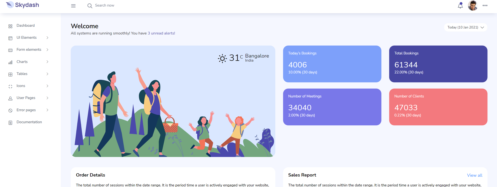

### Instalation
```
git clone: https://github.com/M-Hidayatullah/base-admin-laravel-10-skydash.git
```

### composer install
```
composer install
```

### copy .env
```
cp .env.example
```

### generate keys
```
php artisan key:generate
```

### run projects
```
php artisan serve
```

**Preview dashboard**


# Punya saran, ide, atau pertanyaan?

Kirimkan dengan [membuka issue baru](https://github.com/M-Hidayatullah/base-admin-laravel-10-skydash/issues/new)

#
### Trakteer Coffe, Untuk mendukung developers dalam pengembangan:
<p align="center">
<br>
<a href="https://trakteer.id/m_hidayatullah2/link" target="_blank"></a>
</p>

Credit: [M-Hidayatullah](https://github.com/M-Hidayatullah)

Last Edited on: 17/02/2024
<p align="center">
Menyala Abangku 🔥🔥🔥
</p>
<a href="https://www.youtube.com/channel/UCtCEqyh342MswIXhsF_y76Q"></a>
